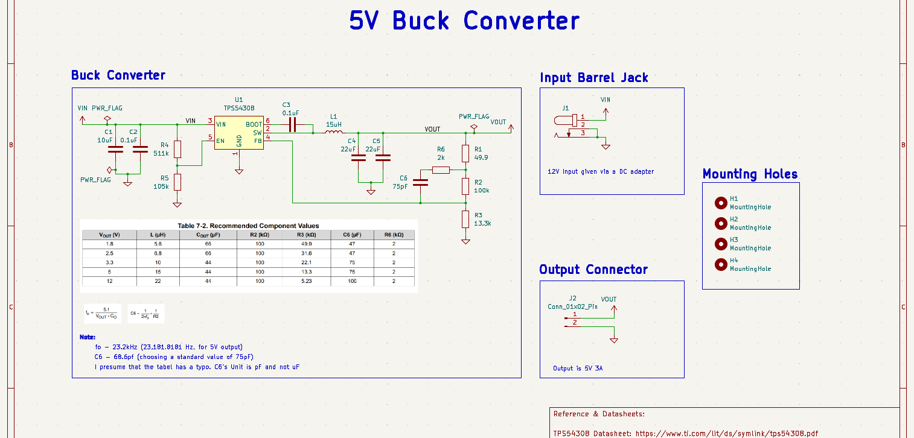
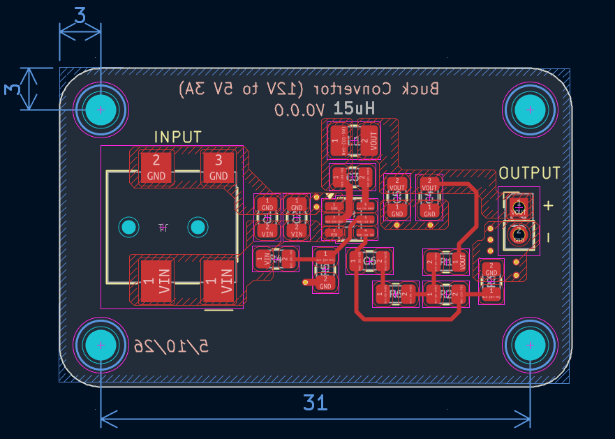
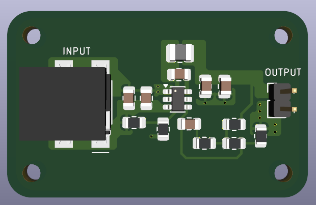
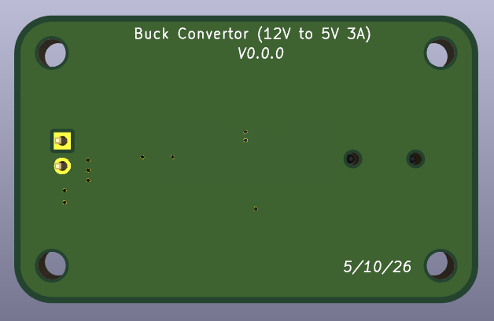

# TPS5430_Buck_5V

A 12V-to-5V synchronous buck converter built around the TI TPS54308, designed in
KiCad.

Schematic and component values derived directly from the TPS54308 datasheet.

## Specs

- **Controller:** TPS54308 (4.5V-28V input, 3A synchronous buck converter, SOT-23-6)
- **Input:** 12V DC via barrel jack
- **Output:** 5V, 3A via 2-pin header
- **Switching frequency:** 350kHz (fixed, internal)
- **Layers:** 2-layer
- **Note:** Found and corrected a unit typo in the datasheet's Table 7-2 (C6
  listed as µF, confirmed via TI's own body text and the compensation equation
  to actually be pF)

## PCB Design

### Schematic

### PCB Layout

### 3D Renders

  
  

